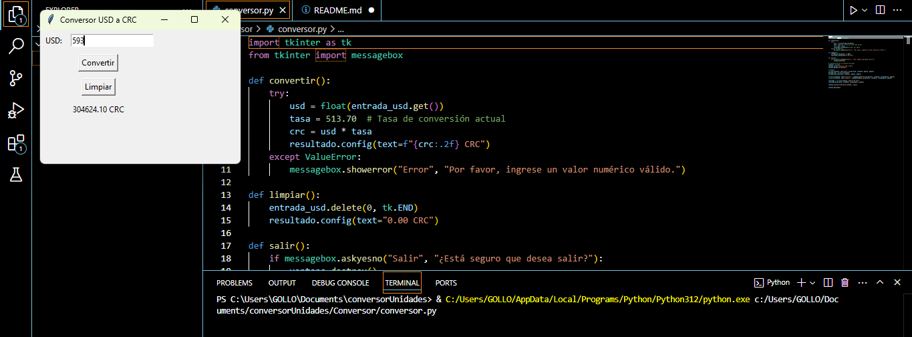
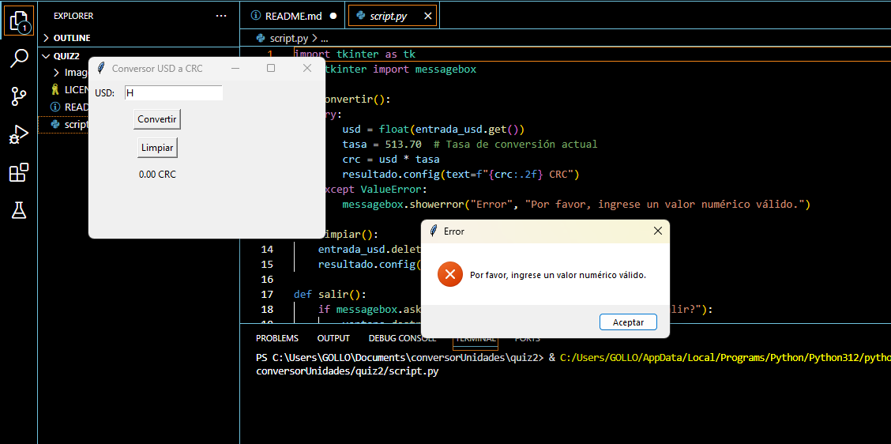
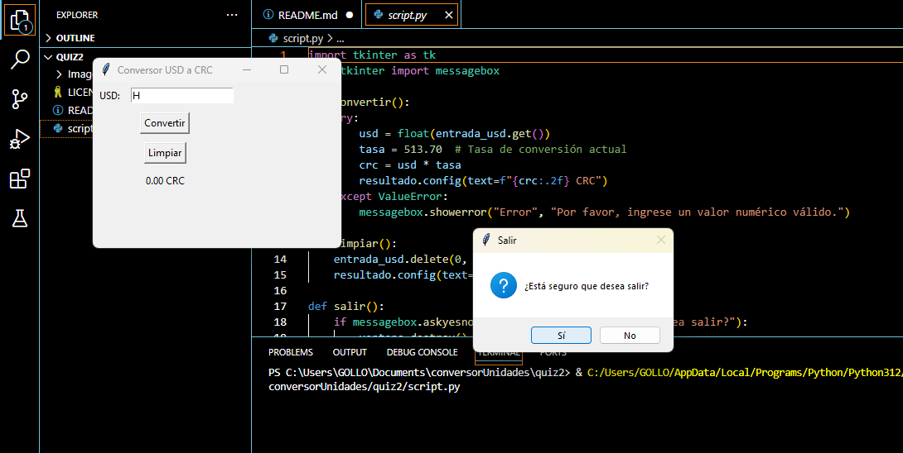

# Conversor de USD a CRC

Este proyecto es un conversor de dólares estadounidenses (USD) a colones costarricenses (CRC) utilizando una interfaz gráfica creada con Tkinter.

## Autor

Nombre completo del propietario del repositorio: Lucía Villarreal
## Instrucciones de uso

1. Asegúrate de tener Python instalado en tu sistema.
2. Clona este repositorio o descarga los archivos.
3. Abre una terminal y navega hasta el directorio del proyecto.
4. Ejecuta el script con el siguiente comando: python script.py
5. Ingresa la cantidad en USD que deseas convertir.
6. Haz clic en el botón "Convertir" para ver el resultado en CRC.
7. Usa el botón "Limpiar" para resetear los campos.
8. Para salir, cierra la ventana y confirma en el cuadro emergente.

## Implementación del código

Este código utiliza Tkinter para crear una interfaz gráfica simple que permite al usuario ingresar un monto en dólares y convertirlo a colones costarricenses. Se valida la entrada para asegurarse de que sea un número y se muestra un mensaje de error si la entrada es inválida.

## Imágenes de la ejecución

1. **Conversión regular con resultado esperado**:

2. **Valor inválido ingresado para la conversión con el mensaje de error**:

3. **Ventana emergente al cerrar la ventana**:

